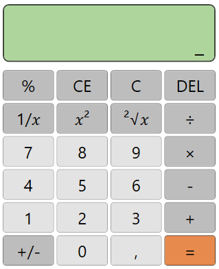

# Calculatrice WPF - C#
 
## Objectif
 
Petit projet d'apprentissage en C# / WPF : une calculatrice de bureau avec interface graphique, construite étape par étape (XAML, styles réutilisables, code-behind) pour se familiariser avec l'écosystème .NET desktop.
 
Le projet inclut :
- Une interface entièrement dessinée en XAML (Grid, Border, StackPanel), sans designer visuel.
- Un système de styles réutilisables avec héritage (`BasedOn`) pour éviter la répétition entre les boutons.
- Une séparation entre la logique d'interface (code-behind) et les calculs (classe `Calculate` dédiée).
- Une gestion des cas d'erreur (division par zéro) sans plantage de l'application.

---
 
## Fonctionnalités
 
- Opérations de base :
  - Addition, soustraction, multiplication, division
- Opérations avancées :
  - Pourcentage (`%`)
  - Carré (`𝑥²`)
  - Racine carrée (`²√𝑥`)
  - Inverse (`1/𝑥`)
  - Changement de signe (`+/-`)
- Saisie :
  - Chiffres 0 à 9 avec accumulation de la saisie
  - Séparateur décimal (`,`), avec blocage d'une seconde virgule sur le même nombre
  - Enchaînement d'opérations (ex: `5 + 3 × 2 =`)
  - Changement d'opérateur en cours de saisie (remplace l'opérateur précédent sans perdre le nombre stocké)
- Suppression :
  - `DEL` : efface le dernier caractère saisi
  - `CE` : efface le nombre en cours (ou tout, si un résultat vient d'être affiché)
  - `C` : réinitialise entièrement la calculatrice
- Gestion des erreurs :
  - Division par zéro interceptée et affichée comme message, sans crash de l'application

---
 
## Architecture
 
L'application suit le modèle **code-behind** propre à WPF, avec une séparation entre l'interface et le calcul :
 
- **XAML (`MainWindow.xaml`)** : décrit la structure visuelle (Grille de 7 lignes × 4 colonnes), les styles des boutons (`BoutonBase`, `BoutonNumero`, `BoutonAction`, `BoutonEgal`) et leur apparence selon l'état (survol, clic) via des `Trigger`.
- **Code-behind (`MainWindow.xaml.cs`)** : contient l'état de la calculatrice (nombre en cours, nombre stocké, opérateur sélectionné) et les méthodes liées aux événements `Click` des boutons.
- **Classe `Calculate`** : classe statique isolée, responsable uniquement des opérations arithmétiques (addition, soustraction, multiplication, division, racine carrée), indépendante de l'interface.
Cette séparation permet de faire évoluer la logique de calcul sans toucher à l'interface, et inversement.
 
---
 
## Structure du projet
 
```
CSharp_Calculator_GUI/
 
    README.md                     # Documentation
    .gitignore                    # Dossiers/fichiers exclus du repository (obj/, bin/...)
    CSharp_Calculator_GUI.csproj  # Fichier de configuration du projet .NET
 
    App.xaml                      # Déclaration de l'application, point d'entrée (StartupUri)
    App.xaml.cs                   # Code-behind de l'application
 
    MainWindow.xaml               # Interface graphique (Grid, styles, boutons)
    MainWindow.xaml.cs            # Logique de la calculatrice et classe Calculate
 
    AssemblyInfo.cs               # Métadonnées de l'assembly

    icon.ico                      # Icone de l'application
    aperçu.png                    # Capture d'écran de l'application
```
 
---
 
## Outils et dépendances
 
- [.NET SDK 10](https://dotnet.microsoft.com/download) (LTS)
- WPF (Windows Presentation Foundation) — inclus dans le SDK .NET pour Windows
- Visual Studio Code + extension **C# Dev Kit**
- `dotnet format` pour la mise en forme automatique du code

Aucune dépendance externe (NuGet) n'est utilisée : le projet repose uniquement sur les bibliothèques standards de .NET/WPF.
 
---
 
## Installation
 
1. Cloner le dépôt :
```bash
       git clone https://github.com/duncan-g-hub/CSharp_Calculator_GUI.git
       cd CSharp_Calculator_GUI
```
 
2. Restaurer les dépendances du projet :
```bash
       dotnet restore
```
 
---
 
## Lancement
 
### En mode développement
 
```bash
dotnet run
```
 
### Vérifier la mise en forme du code
 
```bash
dotnet format
```
 
### Générer un exécutable autonome (.exe)
 
```bash
dotnet publish -c Release -r win-x64 --self-contained true -p:PublishSingleFile=true
```
 
L'exécutable généré se trouve dans `bin/Release/net10.0-windows/win-x64/publish/`. Il peut être lancé directement, sans avoir le SDK .NET installé sur la machine cible.
 
---
 
## Limitations connues
 
- Windows uniquement : WPF ne fonctionne pas sur macOS/Linux (contrairement à d'autres frameworks .NET comme Avalonia).
- Pas de support clavier : seule la souris permet d'interagir avec la calculatrice pour l'instant.
- Précision limitée aux nombres à virgule flottante (`double`), arrondis à 6 décimales — pas adapté à des calculs nécessitant une précision arbitraire.
- Pas de gestion de l'affichage pour les très grands nombres (le texte peut déborder de l'écran au-delà d'un certain nombre de chiffres).
- Le nom du projet ne doit jamais contenir le caractère `#` (conflit avec la syntaxe des URI de ressources WPF).

---
 
## Aperçu
 

 
---
 
## Contact
 
Pour toute question :  
Duncan GAURAT - duncan.dev@outlook.fr